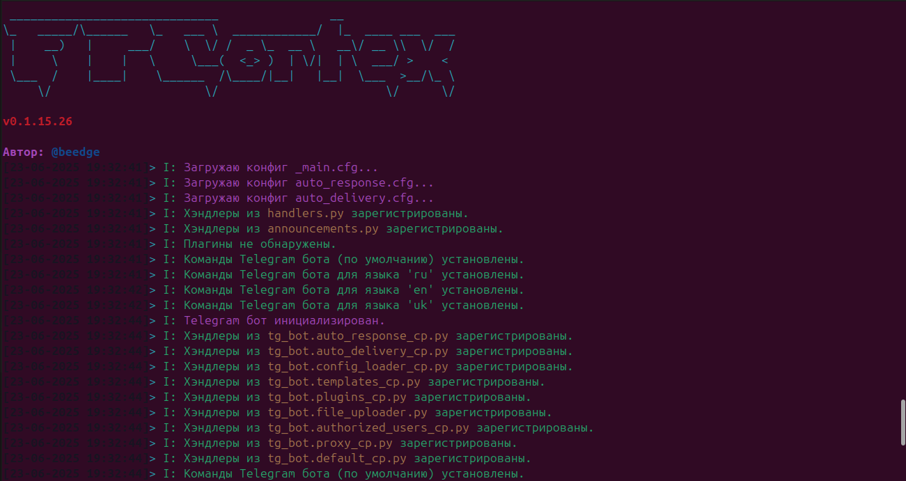
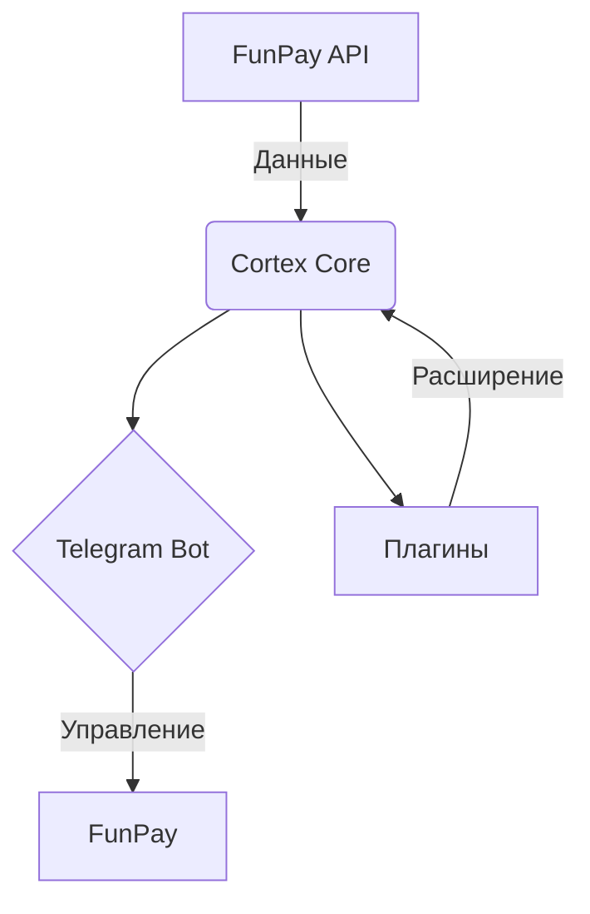

<!-- Open Graph / Twitter Card Meta -->
<meta property="og:title" content="FunPay Cortex — Авто-Бот для FunPay 🔥" />
<meta property="og:description" content="Мощный Telegram-бот для FunPay: автовыдача, автоответы, автоподнятие, плагины. Актуальная версия — в облаке на funpaybot.com" />
<meta property="og:image" content="https://i.imgur.com/mU4Jum5.png" />
<meta name="twitter:card" content="summary_large_image" />

<p align="center">
  
</p>

<p align="center">
  
</p>

<h1 align="center">
  <span style="color:#36CA5C"><b>FunPay Cortex</b></span>
</h1>

<p align="center">
  <b>🤖 Автоматизация FunPay: автовыдача, автоподнятие, автоответы, плагины и полный контроль из Telegram.</b><br/>
  <sub>Этот репозиторий — историческая версия проекта. Актуальный продукт живёт в облаке.</sub>
</p>

<p align="center">
  <a href="https://funpaybot.com"></a>
  <a href="#-статус-репозитория"></a>
</p>

<p align="center">
  <a href="https://t.me/RobotFunPay"></a>
  <a href="https://www.python.org/"></a>
  <a href="https://github.com/Beedgee/FunPayCortex/stargazers"></a>
  <a href="https://opensource.org/licenses/MIT"></a>
</p>

---

## ⚠️ Статус репозитория

> ### 🛑 Публичная версия на GitHub больше **не обновляется**
>
> Разработка открытой версии **FunPay Cortex** остановлена. Код в этом репозитории заморожен и оставлен **как есть** — в качестве архива и справочного материала.
>
> **Что это значит на практике:**
>
> | | |
> |:--|:--|
> | ❌ | **Нет обновлений.** Новые функции, плагины и фиксы сюда не приезжают. |
> | ❌ | **Нет совместимости.** FunPay регулярно меняет вёрстку, API и защиту — старый код ломается: авторизация, парсинг лотов, автоподнятие, автовыдача. |
> | ❌ | **Нет поддержки.** Issues и PR по старой версии не разбираются. |
> | ⚠️ | **Возможны сбои и потеря заказов.** Бот может «молча» не выдать товар, не поднять лот или отвалиться от сессии. |
> | ⚠️ | **Плагины из облака сюда не подходят.** Ядро разошлось — API плагинов, хранилище конфигов и Telegram-панель изменились. |
>
> ### ✅ Всё развитие проекта перенесено в облако — **[funpaybot.com](https://funpaybot.com)**
>
> Там же — актуальное ядро, новые плагины, обновления безопасности и техподдержка.
>
> <p align="left">
>   <a href="https://funpaybot.com"></a>
> </p>

---

<p align="center">
  
</p>

## 🚩 Быстрые ссылки

| [Статус](#-статус-репозитория) | [Облако](#️-funpaybot--облачная-версия) | [Возможности](#-ядро-системы-входит-в-любую-подписку) | [Плагины](#-каталог-плагинов) | [Тарифы](#-тарифы) | [FAQ](#-faq) | [Архив](#-архив-старая-github-версия) |
|:---:|:---:|:---:|:---:|:---:|:---:|:---:|

---

## ☁️ FunPayBot — облачная версия

<p align="center">
  
</p>

**[funpaybot.com](https://funpaybot.com)** — это FunPay Cortex, доведённый до состояния готового сервиса. Никакого Python, venv, VPS, systemd и «почему у меня опять упало ночью».

Регистрируетесь → вводите ключи → бот работает. Управление — из Telegram, как и раньше.

| | Преимущество |
|:--:|:--|
| 🚀 | **Запуск за пару минут.** Ничего не скачивать, не настраивать, не компилировать. |
| 🔌 | **ПК можно выключить.** Бот живёт на выделенных серверах, аптайм > 99.8%. |
| 🔄 | **Автообновления.** FunPay поменял вёрстку — правка прилетает всем пользователям сразу, без вашего участия. |
| 🛡️ | **Приватные IPv4-прокси (РФ).** У аккаунта уникальный IP, тайминги имитируют поведение человека. |
| 🧩 | **Магазин плагинов.** Более 30 готовых модулей в пару кликов. |
| 📱 | **Полный контроль из Telegram.** Лоты, цены, автоответы, статистика, уведомления о заказах. |
| 🆘 | **Живая поддержка.** База знаний + саппорт, а не «форкни и почини сам». |

> 💡 Первичная настройка (ключи, прокси, подписка) — на сайте. Всё дальнейшее — в вашем личном Telegram-боте.

---

## ⚙️ Ядро системы (входит в любую подписку)

<details open>
<summary><b>Базовые возможности — доступны сразу после регистрации</b></summary>

<br/>

| Функция | Что делает |
|:--|:--|
| **♾️ Вечный онлайн 24/7** | Бот работает в облаке. Ваш ПК выключен — лоты поднимаются, сообщения отвечаются, товары выдаются. |
| **⬆️ Автоподнятие лотов** | Предложения непрерывно удерживаются в топе. Рандомизированные тайминги — как живой человек. |
| **⚡ Мгновенная автовыдача** | Текст, файлы, мульти-выдача, связки `login:password`. Оплата → товар у клиента за секунды. |
| **💬 Умный автоответчик** | Триггеры, переменные, шаблоны, приветствия, FAQ. Ответ на вопрос в 3 ночи — за 2 секунды. |
| **📲 Управление из Telegram** | Добавление лотов, смена цен, правка автоответов, статистика — всё в кармане. |
| **⭐ Отзывы и заказы** | Автоблагодарность при подтверждении заказа + автоответы на отзывы по шаблонам от 1 до 5 звёзд. |

</details>

---

## 🧩 Каталог плагинов

> Более **30 готовых решений**. Часть входит в подписку, часть — «плагины 99-го уровня»: сложные интеграции, которые покупаются отдельно и **навсегда** (единоразовый платёж в магазине).
>
> 👉 **[Полный каталог на funpaybot.com/plugins](https://funpaybot.com/plugins)**

<details open>
<summary><b>🧠 ИИ и продажи</b></summary>

<br/>

| Плагин | Описание |
|:--|:--|
| [**GPT Consultant**](https://funpaybot.com/plugins/gpt_consultant) | ИИ анализирует вопрос клиента, считывает информацию о товаре и генерирует осмысленный продающий ответ. |
| [**AI Reviews**](https://funpaybot.com/plugins/gpt_reviews) | Бот читает отзыв покупателя, анализирует товар и пишет персонализированный живой ответ нейросетью. |
| [**Auto Dump**](https://funpaybot.com/plugins/auto_dumping) | Интеллектуальный демпинг: удерживает ваши цены ниже конкурентов, чтобы вы всегда были в топе выдачи. |
| [**Auto Copy PRO**](https://funpaybot.com/plugins/auto_copy_pro) | Клонатор ассортимента: копирует лоты конкурентов или переносит ваши предложения между аккаунтами вместе с параметрами и серверами. |
| [**AutoTicket Manager**](https://funpaybot.com/plugins/auto_ticket) | Гибкая автоматизация отправки тикетов в поддержку FunPay. Экономит массу времени в спорных ситуациях. |

</details>

<details open>
<summary><b>🎮 Steam</b></summary>

<br/>

| Плагин | Описание |
|:--|:--|
| [**Auto Rent Steam**](https://funpaybot.com/plugins/auto_rent_steam) | Полная автоматизация аренды Steam-аккаунтов: от выдачи данных клиенту до смены пароля после окончания времени. |
| [**KOSell Rental**](https://funpaybot.com/plugins/kosell_rental) | Аренда Steam-аккаунтов через маркетплейс KOSell: аренда, выдача данных, генерация Steam Guard, смена пароля по окончании сессии. |
| [**Auto Steam Accounts**](https://funpaybot.com/plugins/auto_steam_accounts) | Превращает ваш FunPay в автоматизированный магазин Steam-аккаунтов под CS2 Prime, Rust, Dota 2 и т.д. |
| [**Steam AutoGifts**](https://funpaybot.com/plugins/auto_steam_gifts_ns) | Автопродажа игр Steam: бот запрашивает ссылку друга, считает цену, покупает игру через NS.Gifts и отправляет клиенту. |
| [**Steam Guard (Mail)**](https://funpaybot.com/plugins/mail_steam_guard) | Автовыдача 2FA-кодов Steam Guard прямо в чат FunPay — бот сам читает письма по IMAP. |

</details>

<details open>
<summary><b>✈️ Telegram</b></summary>

<br/>

| Плагин | Описание |
|:--|:--|
| [**Telegram AutoGift**](https://funpaybot.com/plugins/telegram_gift_auto) | Автопродажа подарков (Gifts) за Stars: выбор аккаунта и отправка подарка по юзернейму полностью автоматически. |
| [**Auto Stars**](https://funpaybot.com/plugins/auto_stars) | Автоматическая продажа Telegram Stars: бот запрашивает ник и пополняет баланс через Fragment. |

</details>

<details open>
<summary><b>🕹️ Roblox и Minecraft</b></summary>

<br/>

| Плагин | Описание |
|:--|:--|
| [**AutoRobux**](https://funpaybot.com/plugins/auto_robux) | Полная автоматизация продажи Robux (R$) методом Transfer (GamePass). |
| [**Auto VIP Roblox**](https://funpaybot.com/plugins/auto_vip_roblox) | Автоматизация сдачи VIP-серверов Roblox в аренду: от выдачи ссылок до кика игроков по истечении времени. |
| [**Auto Minecraft**](https://funpaybot.com/plugins/auto_mc_accounts) | Дропшиппинг аккаунтов Minecraft с LZT Market: выкуп по фильтрам и выдача данных от Microsoft и привязанной почты. |

</details>

<details open>
<summary><b>📦 Дропшиппинг аккаунтов и SMM</b></summary>

<br/>

| Плагин | Описание |
|:--|:--|
| [**Auto AI Accounts**](https://funpaybot.com/plugins/auto_ai_accounts) | Дропшиппинг аккаунтов ChatGPT и Claude с LZT Market: подбор по фильтрам, выкуп и моментальная выдача. |
| [**Auto Instagram**](https://funpaybot.com/plugins/auto_inst_accounts) | Автопродажа Instagram-аккаунтов по дропшиппингу с LZT Market — с выдачей данных от профиля и почты. |
| [**TikTok Dropshipping**](https://funpaybot.com/plugins/auto_tt) | Автоматизация продаж TikTok-аккаунтов через LZT Market: подбор, парсинг статистики профиля, выдача данных. |
| [**AutoSMM**](https://funpaybot.com/plugins/auto_smm) | Превращает FunPay в автоматическое SMM-агентство: приём заказа, отправка ссылки поставщику, подсчёт прибыли. |
| [**NS.Gifts Topup**](https://funpaybot.com/plugins/auto_ns_direct_topup) | Прямое пополнение мобильных игр, соцсетей и мессенджеров через оптового провайдера NS.Gifts. |

</details>

<p align="center"><sub>…и это не весь список. Каталог пополняется — смотрите <a href="https://funpaybot.com/plugins">магазин плагинов</a>.</sub></p>

---

## 💰 Тарифы

Оплачивается **только доступ к облачной инфраструктуре**. Никаких скрытых платежей и комиссий с ваших продаж.

| Период | Скидка |
|:--|:--|
| **1 месяц** | от **199 ₽** |
| **3 месяца** | **−15%** |
| **1 год** | **−35%** |

> 🔎 Актуальные цены и состав тарифов — на странице [funpaybot.com](https://funpaybot.com/#pricing).

---

## ❓ FAQ

<details>
<summary><b>Нужно ли держать компьютер включенным?</b></summary>

<br/>

Нет. Бот размещается на облачных серверах и работает 24/7 автономно. Можно выключить ПК и уйти — бот продолжит выдавать товары и поднимать лоты.
</details>

<details>
<summary><b>Безопасно ли это для аккаунта FunPay?</b></summary>

<br/>

Используются выделенные приватные IPv4-прокси (Россия), чтобы у аккаунта был уникальный IP. Алгоритмы имитируют действия человека и соблюдают безопасные тайминги.
</details>

<details>
<summary><b>Что такое «плагины 99-го уровня»?</b></summary>

<br/>

Это ультимативные модули со сложными интеграциями (авто-аренда Steam, Telegram AutoGift, SMM-накрутка и т.п.). Они **не входят** в стандартные подписки и покупаются отдельно навсегда — единоразовым платежом в магазине плагинов.
</details>

<details>
<summary><b>Как управлять ботом?</b></summary>

<br/>

Первичная настройка (ключи, прокси) — на сайте. Дальше всё в вашем Telegram-боте: лоты, файлы, автоответы, статистика, уведомления о продажах и новых сообщениях.
</details>

<details>
<summary><b>Я уже поставил версию с GitHub. Что делать?</b></summary>

<br/>

Она продолжит запускаться, но никаких обновлений не получит и со временем начнёт ломаться вслед за изменениями FunPay. Рекомендуется перейти на [funpaybot.com](https://funpaybot.com). Конфиги старой версии переносить не нужно — настройка в облаке занимает несколько минут.
</details>

<details>
<summary><b>Можно ли форкнуть и допилить самому?</b></summary>

<br/>

Да, лицензия MIT — код открыт. Но имейте в виду: поддержка форков не оказывается, а совместимость с FunPay придётся чинить своими руками.
</details>

---

## 🗄️ Архив: старая GitHub-версия

> **🛑 Раздел оставлен только для истории.** Инструкции ниже могут не работать. Используйте их на свой страх и риск.

<details>
<summary><b>🛠️ Технологии</b></summary>

<br/>

| Язык | Библиотеки | ОС | Конфиг |
|:----:|:----------:|:--:|:------:|
| Python 3.11+ | pyTelegramBotAPI, Requests, BeautifulSoup4, lxml, psutil, bcrypt | Linux / Windows / Android (Termux) | yaml / json |

Архитектура ядра:



</details>

<details>
<summary><b>🟦 Установка: Windows</b></summary>

<br/>

1. Скачайте <a href="https://www.python.org/downloads/">Python 3.11+</a> и отметьте «Add python.exe to PATH».
2. Скачайте <a href="https://github.com/Beedgee/FunPayCortex/archive/refs/heads/main.zip">архив с кодом</a> и распакуйте.
3. В папке проекта выполните:
    ```shell
    python -m venv venv
    venv\Scripts\activate
    pip install -r requirements.txt
    python main.py
    ```
4. Следуйте инструкциям в консоли и в Telegram-боте.
</details>

<details>
<summary><b>🐧 Установка: Linux (Ubuntu/Debian)</b></summary>

<br/>

```bash
sudo apt update && sudo apt install python3 python3-pip python3-venv git -y
git clone https://github.com/Beedgee/FunPayCortex.git
cd FunPayCortex
python3 -m venv venv
source venv/bin/activate
pip install -r requirements.txt
python main.py
```
</details>

<details>
<summary><b>🤖 Установка: Android (Termux)</b></summary>

<br/>

> Тесты проводились на Termux **0.118.3**.

1. Смените репозитории:
   ```shell
   termux-change-repo
   ```
2. Установите бота:
   ```shell
   pkg install curl -y && curl -sL https://raw.githubusercontent.com/Beedgee/FunPayCortex/main/install.sh | bash
   ```
   ⏳ Установка занимает примерно 10–25 минут.
3. После первичной настройки запустите:
   ```shell
   python main.py
   ```
</details>

<details>
<summary><b>🧩 Плагины в старой версии</b></summary>

<br/>

1. В Telegram-боте: меню 🧩 **Плагины** → ➕ **Добавить**.
2. Отправьте `.py`-файл плагина.

⚠️ Плагины из облачного магазина **несовместимы** с этой версией.
</details>

---

## 🤝 Связь и поддержка

| | |
|:--|:--|
| ☁️ **Сайт** | [funpaybot.com](https://funpaybot.com) |
| 🆘 **Поддержка** | [funpaybot.com/support](https://funpaybot.com/support) · <support@funpaybot.com> |
| 📚 **База знаний** | [funpaybot.com/kb](https://funpaybot.com/kb) |
| 💬 **Telegram-чат** | [@RobotFunPay](https://t.me/RobotFunPay) |
| 👤 **Автор** | [@beedge](https://t.me/beedge) |

> ℹ️ По старой GitHub-версии поддержка **не оказывается**. Issues по ней не разбираются.
>
> Сервис является независимым программным обеспечением и не является официальным партнёром FunPay.

---

## 📃 Лицензия

MIT © Beedgee — код репозитория остаётся открытым и доступным для изучения.

---

<p align="center">
  <a href="https://funpaybot.com"></a>
</p>

<p align="center">
  <a href="https://github.com/Beedgee/FunPayCortex/stargazers"></a>
  <a href="https://github.com/Beedgee/FunPayCortex/fork"></a>
</p>

<p align="center">
  
</p>
